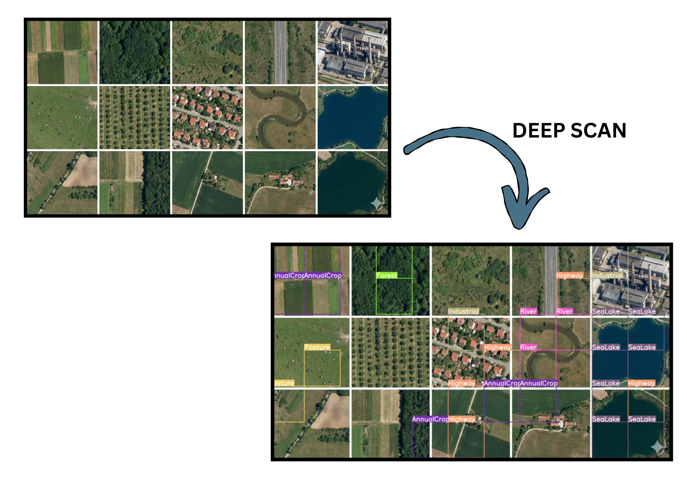

# SATSCAN: Satellite Image AI Analyst
SATSCAN is a deep learning application designed for the automated analysis and classification of geospatial imagery. Leveraging a fine-tuned Vision Transformer (ViT) architecture, the system provides high-accuracy land cover classification and implements a sliding-window inference engine to map semantic features across large-scale satellite maps.

## Table of Contents

1.  [Overview](https://www.google.com/search?q=%23overview)
2.  [Key Features](https://www.google.com/search?q=%23key-features)
3.  [Performance](https://www.google.com/search?q=%23performance)
4.  [Installation](https://www.google.com/search?q=%23installation)
5.  [Usage](https://www.google.com/search?q=%23usage)
6.  [Technical Architecture](https://www.google.com/search?q=%23technical-architecture)
7.  [Dataset](https://www.google.com/search?q=%23dataset)
8.  [License](https://www.google.com/search?q=%23license)

## Overview

Automated interpretation of satellite imagery is critical for environmental monitoring, urban planning, and disaster response. SATSCAN automates this process by dividing high-resolution imagery into processable patches, classifying them using a Transformer-based attention mechanism, and reconstructing the semantic map in real-time.

## View Demo

<p align="center">
  
  
</p>

## Key Features

  * **Vision Transformer Backend:** Deploys `vit-base-patch16-224` pretrained on ImageNet and fine-tuned on geospatial data.
  * **Multi-Class Segmentation:** Capable of distinguishing 10 distinct terrain classes including Industrial, Residential, Forest, and Highway.
  * **Deep Scan Engine:** A custom sliding-window algorithm that processes large-scale images (e.g., 4000x4000px) by analyzing local context windows (250x250px) with configurable stride.
  * **Confidence Visualization:** Filters predictions based on a user-defined probability threshold to reduce false positives.
  * **Legacy Compatibility:** Engineered to bridge the gap between TensorFlow 2.16+ (Keras 3) and Hugging Face Transformers.

## Performance & Evaluation

The model was rigorously evaluated on the EuroSAT validation dataset (27,000 samples). We utilized **Intersection over Union (IoU)** and **Dice Coefficient (F1-Score)** as primary metrics to assess the model's precision in distinguishing between spectrally similar land cover classes.

### 1. Overall Metrics
| Metric | Score | Description |
| :--- | :--- | :--- |
| **Overall Accuracy** | **97.91%** | Percentage of correctly classified image patches. |
| **Mean F1-Score (Dice)** | **0.9782** | Harmonic mean of precision and recall, indicating robust class balance. |
| **Mean IoU (Jaccard)** | **0.9578** | Average overlap between predicted and ground truth labels. |

### 2. Class-Wise Performance
The model demonstrates consistent high performance across all 10 terrain classes, with particularly strong results in identifying industrial areas and forests.

| Class Label | IoU (Jaccard) | Dice (F1-Score) |
| :--- | :--- | :--- |
| **Annual Crop** | 0.9485 | 0.9736 |
| **Forest** | 0.9823 | 0.9910 |
| **Herbaceous Vegetation**| 0.9182 | 0.9574 |
| **Highway** | 0.9704 | 0.9850 |
| **Industrial** | 0.9857 | 0.9928 |
| **Pasture** | 0.9137 | 0.9549 |
| **Permanent Crop** | 0.9283 | 0.9628 |
| **Residential** | 0.9859 | 0.9929 |
| **River** | 0.9625 | 0.9809 |
| **Sea / Lake** | 0.9820 | 0.9909 |

### 3. Confusion Matrix Analysis
* **High Precision:** The model achieves near-perfect classification for **Residential** (99.29% F1) and **Industrial** (99.28% F1) zones, likely due to distinct geometric features.
* **Minor Ambiguity:** Slight confusion was observed between *Herbaceous Vegetation* and *Pasture* (IoU ~0.91), which share similar spectral signatures in satellite imagery.

### 4. Inference Speed
* **GPU Latency:** ~45ms per image patch.
* **Full Map Scan:** A 4000x4000px satellite map is processed and annotated in approximately 15-20 seconds using the Deep Scan sliding window engine.

*Note: Performance may vary based on the specific hardware acceleration available.*

## Installation

### 1\. Clone the Repository

```bash
git clone https://github.com/yourusername/SATSCAN.git
cd SATSCAN
```

### 2\. Environment Setup

It is recommended to use a virtual environment to manage dependencies.

```bash
python -m venv venv
source venv/bin/activate  # On Windows use: venv\Scripts\activate
```

### 3\. Install Dependencies

```bash
pip install -r requirements.txt
```

*If `requirements.txt` is missing, install manually:*

```bash
pip install tensorflow transformers opencv-python streamlit numpy tf_keras
```

## Usage

### Model Configuration

Ensure the fine-tuned model artifacts are present in the project directory:

  * `eurosat_vit_augmented/config.json`
  * `eurosat_vit_augmented/tf_model.h5`

### Launching the Interface

Execute the Streamlit application:

```bash
streamlit run app.py
```

The interface will be accessible at `http://localhost:8501`.

### Inference Modes

1.  **Quick Classify:** Analyzes the global context of a single uploaded image patch.
2.  **Deep Scan:** Iteratively scans a high-resolution map to detect and label specific features (e.g., locating a highway within a forest).

## Technical Architecture

The solution implements a strict pipeline to ensure data consistency between training and inference:

1.  **Preprocessing:**

      * Resizing: Bicubic interpolation to 224x224.
      * Normalization: Pixel intensity scaling to range [-1, 1].
      * Channel Ordering: Transposition from (H, W, C) to (C, H, W) to satisfy ViT requirements.

2.  **Augmentation Strategy:**
    During training, the model utilized random spatial transformations (rotation, zoom, flip) and photometric distortions (contrast) to improve generalization on unseen satellite data.

## Dataset

This project utilizes the **EuroSAT** dataset.

> Helber, P., Bischke, B., Dengel, A., & Borth, D. (2019). EuroSAT: A Novel Dataset and Deep Learning Benchmark for Land Use and Land Cover Classification. IEEE Journal of Selected Topics in Applied Earth Observations and Remote Sensing.

## License

Distributed under the MIT License. See `LICENSE` for more information.

-----
**Institution:** Thapar Institute of Engineering and Technology
